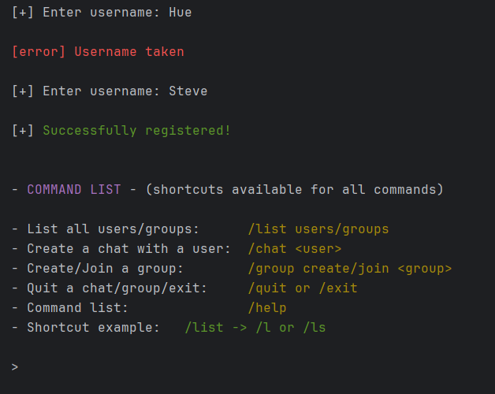
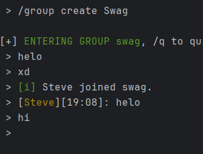
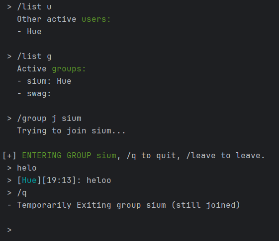
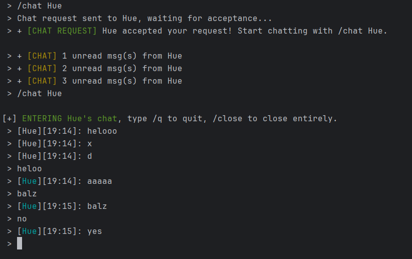

# Encrypted Chat System



Simple terminal-based chat application in Java. It uses a central server and supports private chats, public group chats, and TLS-encrypted communication over TCP sockets.
The system is designed to work across multiple devices on the same network.


### ⚙ How to run:

- Install JDK 24, intellij, clone the repo in a new project and add gson-2.3.1.jar to dependencies;

- Compile Server, ClientMain, and run them with  ```java -jar server.jar```/```client.jar```.

### 🔒 TLS Encryption
If you want to use the TLS encrypted sockets:

- Before compiling comment out the plain ServerSocket logic in the server and the plain Socket constructor in ClientMain, then uncomment the 2 SSLSocket logic parts;

- On intellij terminal run: ```keytool -genkeypair -alias chatserver -keyalg RSA -keysize 2048 -storetype PKCS12 -keystore server.p12 -validity 3650```;

- Insert ```localhost``` as CN, then insert the file name and password in the server function ```createSSLServerSocket```;

- Compile and insert the .p12 file in the same directory as the server jar.


# 🗨 Chat



Once running the app the user must register with a unique username, once the server confirms the new identity a menu showing all the options will popup:

- Listing all users/groups;
- Creating a chat with a user;
- Creating a new public group chat or Joining a public group chat;
- Quitting a chat, group, or the program entirely;
- Showing the menu again;
- Shortcut example (short aliases are supported, like /l, /g, /c).



On the right are images that show some flow examples:

In the first image a user creates the group "Swag" with the command ```/g c Swag``` and another user joins (with ```/g j Swag```). 

In the second picture another user lists all the active groups/users and joins a group, in the list appears an empty group, it's a bug i already fixed.

All the messages show their timestamp and the colored user's nickname, every user is assigned a color based on the ordinal number of users connected to the server (if i remember correctly the first user gets blue, the second yellow, etc.)

A user can temporarily quit the chat with ```/q```, and join in it again with ```/group join Group1``` or ```/g j Group1```. While the user is not actively in the group he will still be notified when someone sends a message with a ``` + x unread msg(s) from y``` notification, the same thing applies for single chats. To leave a group use ```/leave G1``` or ```/l G1```, if a group is empty it gets deleted. 



Direct user messaging requires a chat request, in the example on the right a user sends a chat request to Hue, when Hue accepts the first user is notified and he will be able to start chatting with ```/chat Hue```. The chat is not automatically opened because someone can send many requests to other users, so the chat must be explicitly opened by the user, allowing him quit the current with ```/q``` and join others whenever he wants.

If a user in a chat or group leaves with ```/q```, any message sent there will be queued, and when the user comes back to the chat all the previous messages are printed, but the users' nicknames won't be colored : (

# 💻 Code
This app is a simple chat system managed by a central server which uses a central ServerSocket/SSLServerSocket, for each client connection a ConnManager instance is created, which runs in its own thread and maintains shared state using some thread-safe structures: 

- Connected clients;
- Groups + members;
- Group messages;
- Pending chat requests;
- Active chats;
- Active groups;
- Lock (used a couple of times to avoid some race conditions);
- Copy of socket, in, out, gson (all communication uses JSON messages serialized with Gson jar).

The server first implements a simple validation logic which makes sure that usernames are unique, then it starts the loop for the message communication. In this loop commands are handled with a simple function that based on the message's type validates it before execution, for example groups must exist when asked to be joined, and chat requests require an explicit acceptance. Also any disconnection triggers cleanup, which closes active chats, updates group membership, and removes clients from server state.

Each client uses a dedicated reader thread for incoming messages and a main thread for handling basic user input/commands. Communication is fully asynchronous also thanks to internal structures and queues:

- General server messages queue;
- Chat msgs queue;
- Pending chat requests;
- Active chats;
- Active and opened chats;
- Active groups;
- Active and opened groups;
- Group msgs queue;
- General group msg queue (for logging errors);

The general server messages queue is mostly used for the list command because at first i didn't want to use the reader thread, in the end i kept it this way. 

